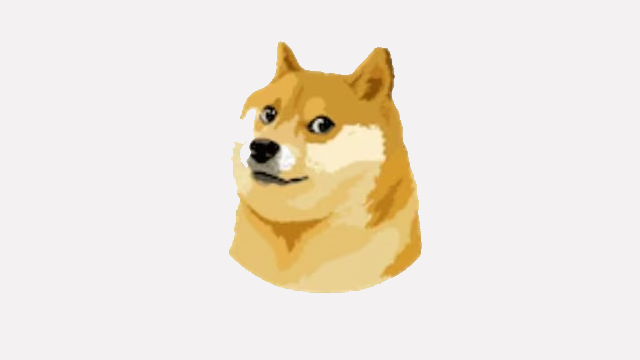

# Vision Tasks 

Tasks that require generating actionable items while browsing through the web.
Tasks that require using huggingface vision/multimodal models as tools.

**Authors:** FILL IN ME

## Example

**Input**

Question: Transform the pose of character in `tool_usage_vision_2_character.png`` to be same as the post of the person in `tool_usage_vision_2_person.png``.

`tool_usage_vision_2_person.png`


`tool_usage_vision_2_character.png`

```
Task planning: 
1: {'task': 'image-to-text', 'id':0, 'dep': [-1], 'args': {'image': 'tool_usage_vision_2_character.png'}
2: {'task': 'pose-detection', 'id': 1, 'dep': [-1], 'args': {'image': 'tool_usage_vision_2_person.png'}
3: {'task': 'pose-text-to-image', 'id':2, 'dep': [0,1], 'args': {'text': <resource>-0', 'image': '<resource>-1}}
```
**Output**
['nlpconnect/vit-gpt2-image-captioning', 'openpose-control', 'lllyasviel/sd-controlnet-openpose']
## What is the task trying to measure?

The task aims to evaluate the ability of Language Models (LMs) to accurately select appropriate models from a provided list.

## Motivation

FILL IN ME

## Related work

HuggingGPT (https://arxiv.org/pdf/2303.17580.pdf)
