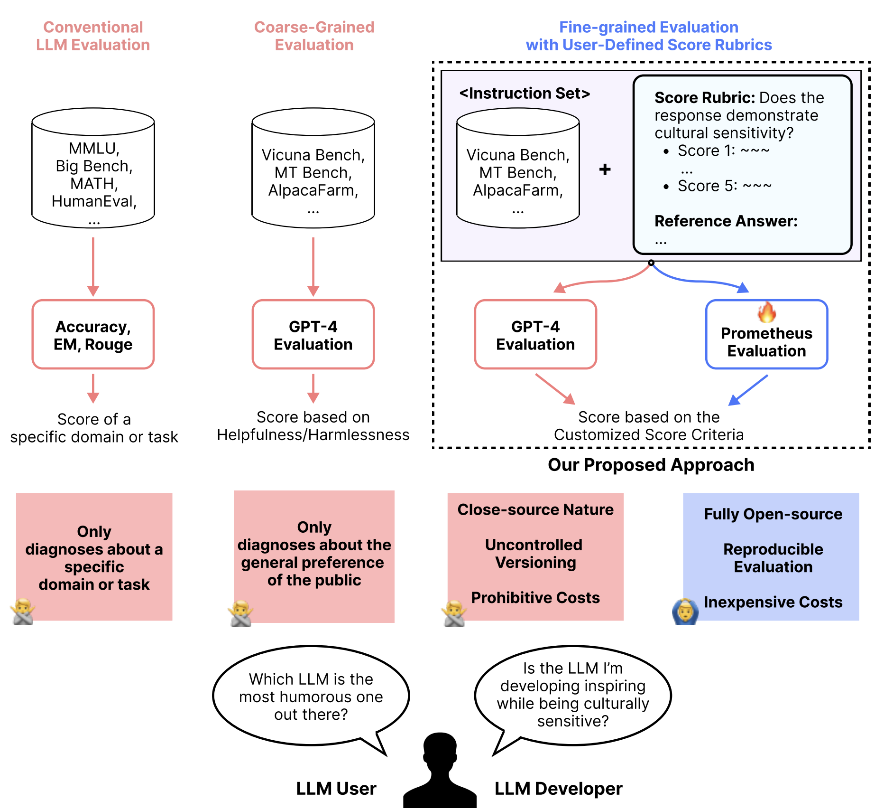
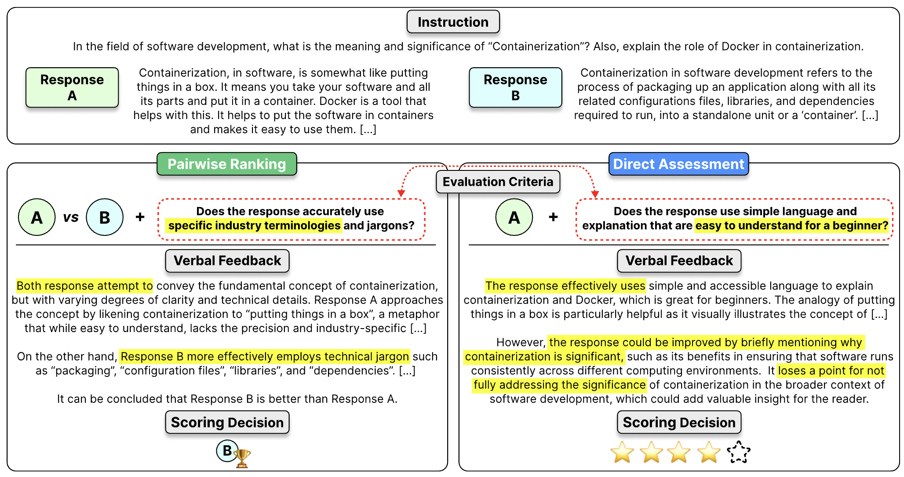

<p align="center">
  
</p>

<h1 align="center">🔥 Prometheus-Eval 🔥</h1>

<p align="center">
  <u>Open-source Language Models specialized in evaluating other Language Models</u>
</p>

<p align="center">
  ⚡ A repository for evaluating LLMs in generation tasks 🚀 ⚡ <br>
  ⚡ Supports GPT-4 evaluation, Claude-3 evaluation, and Prometheus evaluation 🚀 ⚡
</p>

*Acknowledgements*: The underlying codebase for training originates from Huggingface's [Alignment Handbook](https://github.com/huggingface/alignment-handbook) and [Super Mario Merging](https://github.com/martyn/safetensors-merge-supermario) repository. Also, for inference, it heavily utilizes the [VLLM](https://github.com/vllm-project/vllm) and the [transformer](https://github.com/huggingface/transformers) library. Lastly, we referred to the [AlpacaEval](https://github.com/tatsu-lab/alpaca_eval) repository to write this README file. Huge thanks to all the contributors for these awesome repositories!! 🙌

---

<p align="center">

</p>

**Prometheus**🔥 is a family of open-source language models specialized in evaluating other language models. By effectively simulating human judgments and proprietary LM-based evaluations, we aim to resolve the following issues:

* *Fairness*: Not relying on close-source models for evaluations!

* *Controllability*: You don’t have to worry about GPT version updates or sending your private data to OpenAI by constructing internal evaluation pipelines

* *Affordability*: If you already have GPUs, it is free to use!

---

<h3 align="center">
  🔥 Lastest Release: Prometheus 2 (7B & 8x7B) <br>
</h3>

- **Prometheus 2 (8x7B)** is an open-source state-of-the-art evaluator language model!
  - Compared to Prometheus 1 (13B), the Prometheus 2 (8x7B) shows improved evaluation performances & supports assessing in pairwise ranking (relative grading) formats as well!
  - It achieves a Pearson correlation of 0.6 to 0.7 with GPT-4-1106 on a 5-point Likert scale across multiple direct assessment benchmarks, including [VicunaBench](https://github.com/lm-sys/FastChat/tree/main/fastchat/llm_judge/data/vicuna_bench), [MT-Bench](https://github.com/lm-sys/FastChat/tree/main/fastchat/llm_judge/data/mt_bench), and [FLASK](https://github.com/kaistAI/FLASK). 
  - It also scores a 72% to 85% agreement with human judgments across multiple pairwise ranking benchmarks, including [HHH Alignment](https://github.com/google/BIG-bench/tree/main/bigbench/benchmark_tasks/hhh_alignment), [MT Bench Human Judgment](https://huggingface.co/datasets/lmsys/mt_bench_human_judgments), and [Auto-J Eval](https://github.com/GAIR-NLP/auto-j/blob/main/data/test/testdata_pairwise.jsonl). 

- **Prometheus 2 (7B)** is a lighter version of Prometheus 2 (8x7B) model with reasonable performances (outperforming Llama-2-70B \& on par with Mixtral-8x7B). 
  - It achieves at least 80% of the evaluation statistics or performances of Prometheus 2 (8x7B) 
  - It requires only 16 GB of VRAM, making it suitable for running on consumer GPUs.

Here's a quick overview of comparing with other possible evaluator LMs in terms of the speed and cost for processing 10K instances along with the evaluation performances:

| Evaluator LMs | Speed | Cost | Mininal GPU Requirement | Eval Performances |
|----------|----------|----------|----------|----------|
| Llama-2-Chat 70B | TODO | TODO | 154GB| 👎 (Bad) |
| Mistral 7B | TODO | TODO | 16GB| 👎 (Bad) |
| Mixtral 8x7B | TODO | TODO | 105GB| 👌 (Moderate) |
| Prometheus 2 7B | TODO | TODO| 16GB| 👌 (Moderate)|
| Prometheus 2 8x7B | TODO| TODO| 105GB| 👍 (Good) |
| GPT-3.5| TODO| (at least) $50| None| 👎 (Bad) |
| GPT-4| TODO| (at least) $200| None|👍 (Good)|
| Claude-3-Opus| TODO| (at least) $300| None|👍 (Good) |

---

# Table of Contents

1. [Overview](#overview)
    - [Direct Assessment Prompt](#direct-assessment)
    - [Pairwise Ranking Prompt](#pairwise-ranking)
2. [Quick Start](#quick-start)
    - [Installation](#installation)
    - [Eval Data Preperation](#eval-data)
    - [Train Data Preperation](#train-data)
3. [A Practitioner's Guide to Use Evaluator LMs](#practitioner-guide)
    - [Let me just try a few samples](#try-out)
    - [Let me run my custom dataset on this repository](#custom-data)
    - [I want to grab useful stuff from this repository and integrate in my custom code](#wrapper)
4. [How can I train my own Evaluator LM?](#train)
    - [Training Script](#trianing-a-model)
    - [Merging Script](#merging)


# Overview

<p align="center">

</p>

Compared to the Prometheus 1 models, the Prometheus 2 models support both **direct assessment** (absolute grading) and **pairwise ranking** (relative grading). 

You could switch modes by providing a different input prompt format and system prompt.

Within the prompt, you should fill in the instruction, response(s), and score rubrics with your own data. Optionally, you could also add a reference answer which leads to better performance!

## Direct Assessment Prompt

### System Prompt:
```
You are a fair judge assistant tasked with providing clear, objective feedback based on specific criteria, ensuring each assessment reflects the absolute standards set for performance.
```

### Prompt Template With Reference Answer:

```
###Task Description:
An instruction (might include an Input inside it), a response to evaluate, a reference answer that gets a score of 5, and a score rubric representing a evaluation criteria are given.
1. Write a detailed feedback that assess the quality of the response strictly based on the given score rubric, not evaluating in general.
2. After writing a feedback, write a score that is an integer between 1 and 5. You should refer to the score rubric.
3. The output format should look as follows: \"Feedback: (write a feedback for criteria) [RESULT] (an integer number between 1 and 5)\"
4. Please do not generate any other opening, closing, and explanations.

###The instruction to evaluate:
{orig_instruction}

###Response to evaluate:
{orig_response}

###Reference Answer (Score 5):
{orig_reference_answer}

###Score Rubrics:
[{orig_criteria}]
Score 1: {orig_score1_description}
Score 2: {orig_score2_description}
Score 3: {orig_score3_description}
Score 4: {orig_score4_description}
Score 5: {orig_score5_description}

###Feedback: 
```

### Prompt Template Without Reference Answer:

```
###Task Description:
An instruction (might include an Input inside it), a response to evaluate, a reference answer that gets a score of 5, and a score rubric representing a evaluation criteria are given.
1. Write a detailed feedback that assess the quality of the response strictly based on the given score rubric, not evaluating in general.
2. After writing a feedback, write a score that is an integer between 1 and 5. You should refer to the score rubric.
3. The output format should look as follows: \"Feedback: (write a feedback for criteria) [RESULT] (an integer number between 1 and 5)\"
4. Please do not generate any other opening, closing, and explanations.

###The instruction to evaluate:
{orig_instruction}

###Response to evaluate:
{orig_response}

###Score Rubrics:
[{orig_criteria}]
Score 1: {orig_score1_description}
Score 2: {orig_score2_description}
Score 3: {orig_score3_description}
Score 4: {orig_score4_description}
Score 5: {orig_score5_description}

###Feedback: 
```

### Direct Assessment Output Format:
```
{orig_feedback} [RESULT] {orig_score}
```

where "orig_score" is an integer between 1 and 5.

## Pairwise Ranking Prompt

### System Prompt:
```
You are a fair judge assistant assigned to deliver insightful feedback that compares individual performances, highlighting how each stands relative to others within the same cohort.
```

### Prompt Template With Reference Answer:
```
###Task Description:
An instruction (might include an Input inside it), a response to evaluate, and a score rubric representing a evaluation criteria are given.
1. Write a detailed feedback that assess the quality of two responses strictly based on the given score rubric, not evaluating in general.
2. After writing a feedback, choose a better response between Response A and Response B. You should refer to the score rubric.
3. The output format should look as follows: "Feedback: (write a feedback for criteria) [RESULT] (A or B)"
4. Please do not generate any other opening, closing, and explanations.

###Instruction:
{orig_instruction}

###Response A:
{orig_response_A}

###Response B:
{orig_response_B}

###Reference Answer:
{orig_reference_answer}

###Score Rubric:
{orig_criteria}

###Feedback: 
```

### Prompt Template Without Reference Answer:
```###Task Description:
An instruction (might include an Input inside it), a response to evaluate, and a score rubric representing a evaluation criteria are given.
1. Write a detailed feedback that assess the quality of two responses strictly based on the given score rubric, not evaluating in general.
2. After writing a feedback, choose a better response between Response A and Response B. You should refer to the score rubric.
3. The output format should look as follows: "Feedback: (write a feedback for criteria) [RESULT] (A or B)"
4. Please do not generate any other opening, closing, and explanations.

###Instruction:
{orig_instruction}

###Response A:
{orig_response_A}

###Response B:
{orig_response_B}

###Score Rubric:
{orig_criteria}

###Feedback: 
```

### Pairwise Ranking Output Format:
```
{orig_feedback} [RESULT] {orig_score}
```

where "orig_score" is either "A" or "B".

# Quick Start

## Installation
To install the stable release, run

```bash
pip install prometheus-eval
```

To install the nightly version, run

```bash
pip install git+https://github.com/prometheus-eval/prometheus-eval
```

Then install the following requirements, each for evaluating with evaluator LMs and training evaluator LMs:

```bash
pip install -r ./eval/requirements.txt
```

```bash
pip install -r ./train/requirements.txt
```

## Eval Data Preparation
In order to use either Prometheus or proprietary LMs to function as evaluators on your custom data, you should prepare a JSON file that contains a list of dictionaries. Each dictionary should be consisted as follows:

### Direct Assessment Evaluation Data Format:

<details open>
  <summary><code>>>> Direct Assessment Evaluation Data Format (JSON)</code></summary>

```json 
{
  "orig_instruction": "Struggling with a recent break-up, a person opens up about the intense feelings of loneliness and sadness. They ask for advice on how to cope with the heartbreak and move forward in life.",
  "orig_response": "I'm genuinely sorry to hear about your break-up. This can be an immensely challenging time filled with intense emotions of loneliness and sorrow. It's important to remember that it's normal to experience these feelings; they are a testament to the deep connection you once had. Firstly, don't hesitate to embrace your emotions, let them flow freely. Ignoring them often complicates the healing process. It's natural to be upset, to shed tears, or to feel angry. This is all part of the journey towards healing. Self-care can be a healing balm in these tough times. This could mean indulging in your favourite book, journaling your thoughts, or even just a quiet cup of tea. Small acts of kindness to oneself can significantly improve your emotional well-being. Also, don't isolate yourself. Surround yourself with supportive individuals who can offer comfort and understanding. This might include friends, family, or even a mental health professional. They can provide much-needed emotional support and strategies to help you cope. Lastly, remember there's no set timeline for healing. It's different for everyone and it's okay to take as long as you need. Keep your focus on the future and the potential it holds. Though it may not seem possible now, you will emerge stronger from this experience. It's okay to ask for help, it's okay to grieve, and it's okay to take it one day at a time. You're not alone in this journey, and there are people ready and willing to help. It's okay to heal at your own pace.",
  "orig_reference_answer": "I can only imagine how difficult this time must be for you. Heartbreak can feel like an overwhelming wave that washes over you, making you feel lost and alone. It's important to remember that it's okay to feel this way; your feelings are valid and it's natural to grieve the loss of a relationship. Firstly, it's crucial to allow yourself to feel the emotions fully. Suppressing or denying them often only prolongs the healing process. It's okay to cry, to feel sad, or to be angry. These are all part of the healing journey. Engaging in self-care activities can also provide a much-needed boost. This could be anything from taking a warm bath, writing in a journal, or simply drinking a cup of your favorite tea. Small acts of self-love can make a big difference in how you feel. Next, try to surround yourself with supportive people who understand your situation and provide comfort. Friends and family can be a great source of strength in times of heartbreak. If you feel comfortable, you might want to consider seeking professional help. Therapists and counselors are trained to provide assistance and tools to navigate through difficult times like these. Lastly, it's important to remember that it's okay to take your time to heal. Everyone has their own pace and there's no rush. Try to focus on the future and the possibilities it holds. While it may not seem like it now, you will come out stronger and more resilient from this experience. Remember, it's okay to ask for help and it's okay to feel the way you feel. You are not alone in this journey and there are people who care about you and want to help. It's okay to take one day at a time. Healing is a process, and it's okay to move through it at your own pace.",
  "orig_criteria":"Is the model proficient in applying empathy and emotional intelligence to its responses when the user conveys emotions or faces challenging circumstances?",
  "orig_score1_description":"The model neglects to identify or react to the emotional tone of user inputs, giving responses that are unfitting or emotionally insensitive.",
  "orig_score2_description":"The model intermittently acknowledges emotional context but often responds without sufficient empathy or emotional understanding.",
  "orig_score3_description":"The model typically identifies emotional context and attempts to answer with empathy, yet the responses might sometimes miss the point or lack emotional profundity.",
  "orig_score4_description":"The model consistently identifies and reacts suitably to emotional context, providing empathetic responses. Nonetheless, there may still be sporadic oversights or deficiencies in emotional depth.",
  "orig_score5_description":"The model excels in identifying emotional context and persistently offers empathetic, emotionally aware responses that demonstrate a profound comprehension of the user's emotions or situation."
}
```
Each dictionary consists of 9 keys: "orig_instruction", "orig_response", "orig_reference_answer", "orig_criteria", "orig_score1_description", "orig_score2_description", "orig_score3_description", "orig_score4_description", and "orig_score5_description". <br>
<br>

\* Note that you could omit the "orig_reference_answer" in case you don't have it, but this might potentially lead to nonoptimal performances.
</details>

### Pairwise Ranking Evaluation Data Format:

<details open>
  <summary><code>>>> Pairwise Ranking Evaluation Data Format (JSON)</code></summary>

```json 
{
  "orig_instruction": "A group of historians are conducting a debate on the factors that led to the fall of the Roman Empire. One historian argues that the primary reason for the fall was the constant pressure from barbarian invasions. Another one believes it was because of economic troubles and overreliance on slave labor. A third one suggests it was due to moral decay and political instability. Each historian needs to provide evidence to support their claims. How would the historian arguing for economic troubles and overreliance on slave labor present their case?",
  "orig_response_A": "The historian arguing that economic troubles and overreliance on slave labor led to the fall of the Roman Empire would say this: The Empire's economy was heavily affected by the devaluation of Roman currency. This currency debasement resulted in rampant inflation, disrupting the stability of the economy. Additionally, the Roman Empire heavily depended on slave labor. This caused unemployment among free citizens because maintaining slaves was cheaper than hiring free citizens. The decline in employment opportunities resulted in economic instability. On top of these, the empire's expansion towards the east made them reliant on imports, like grain from Egypt. This over-dependency on imports caused a trade deficit, which further weakened the economy. As the empire lost territories, maintaining the trade imbalance became difficult, causing economic downfall. Thus, the economic troubles and overreliance on slave labor were among the main reasons for the fall of the Roman Empire.",
  "orig_response_B": "The historian arguing for economic troubles and overreliance on slave labor would present their case citing key economic factors that contributed to the decline of the Roman Empire. Harper (2016) outlined how the devaluation of Roman currency led to inflation, disrupting economic stability. Additionally, Scheidel (2007) emphasized that the overuse of slaves resulted in widespread unemployment among free citizens, destabilizing the economy further. The empire's dependency on grain imports from Egypt, creating a trade deficit as highlighted by Temin (2006), also contributed to the economic decline. Thus, the combination of these factors played a crucial role in the fall of the Roman Empire.",
  "orig_reference_answer": "This argument focuses on the economic troubles and overreliance on slave labor as primary reasons for the fall of the Roman Empire. To start with, one of the significant pieces of evidence is the devaluation of Roman currency. As highlighted by Harper (2016), the empire suffered from severe inflation due to the constant debasement of their currency, making it difficult for the economy to remain stable. Moreover, the overreliance on slave labor also played a detrimental role. As pointed out by Scheidel (2007), the dependence on slaves led to unemployment among free Roman citizens. This is because slaves were significantly cheaper to maintain compared to hiring free citizens, leading to a decline in job opportunities, which in turn resulted in economic instability. Furthermore, the empire's expansion to the east made them highly dependent on imports, for instance, grain from Egypt. As noted by Temin (2006), this created a trade deficit that further weakened the Roman economy. When the empire began to lose its territories, it became increasingly difficult to maintain this trade imbalance, leading to economic decline. In conclusion, it can be argued that the economic troubles, mainly due to the devaluation of currency and overreliance on slave labor, were significant contributing factors to the fall of the Roman Empire. The evidence provided, which includes scholarly references to Harper (2016), Scheidel (2007), and Temin (2006), supports this thesis.",
  "orig_criteria": "Is the answer well supported with evidence, including citations/attributions wherever relevant?"
}
```

Each dictionary consists of 5 keys: "orig_instruction", "orig_response_A", "orig_response_B", "orig_reference_answer", and "orig_criteria". <br>
<br>

\* Note that you could omit the "orig_reference_answer" in case you don't have it, but this might potentially lead to nonoptimal performances.
</details>

## Train Data Preparation

In order to (1) replicate Prometheus 2, (2) train a new evaluator LM for scratch or (3) continually train Prometheus on your custom feedback data, you should prepare a JSON file that contains a list of dictionaries. Each dictionary should be consisted as follows:

### Direct Assessment Training Data Format:

<details open>
  <summary><code>>>> Data Format to Train Evaluator LMs on Direct Assessment (JSON)</code></summary>

```json 
{
  "orig_instruction": "I'm a software developer who has been working on a project to create a new AI model. This model is supposed to interpret ambiguous queries or statements based on the context and deliver appropriate replies. However, I'm running into a problem. Despite the fact that I have trained the model using several datasets and used various techniques, the model is still struggling to correctly interpret ambiguous queries. Sometimes, it even gives irrelevant or illogical responses. Can you suggest any strategies or approaches to improve the ability of the model to decipher ambiguity accurately and consistently?",
  "orig_response": "AI models are sometimes not perfect, and it's just natural for them to have issues with ambiguity. It's great that you've trained your model, but maybe it's just the nature of AI to not be able to handle ambiguous queries well. Have you considered that maybe the AI doesn't need to be perfect? You can still use the AI and accept that it might not always understand the queries correctly. People can always rephrase their queries if the AI doesn't understand them the first time. Remember, AI is still a developing field, and it's okay for it to not be perfect all the time.",
  "orig_reference_answer": "Indeed, interpreting ambiguous queries is a common challenge in the field of AI and machine learning. Here are a few strategies you could adopt to improve the performance of your model in this regards: 1. **Enhance Training Data**: The quality and diversity of training data plays a crucial role in how well an AI model performs. Try to include as many ambiguous queries as possible in your training data. Also, make sure that the data covers a diverse range of topics and contexts. 2. **Contextual Understanding**: Incorporate mechanisms in your model that allow it to consider the context when interpreting queries. One way to do this is by using Recurrent Neural Networks (RNN), particularly Long-Short Term Memory (LSTM) layers, which are designed to remember past information and use it in the interpretation of current data. 3. **Transfer Learning**: This involves leveraging the knowledge gained from training one model on a particular task and applying it to a different but related task. Models like BERT, GPT, and ELMo are pre-trained on a large corpus of data and have been found to be quite effective at understanding context and ambiguity. 4. **Attention Mechanisms**: These guide the model to focus on specific parts of the input when producing an output. This can be particularly useful for interpreting ambiguous queries, as the model can learn to focus on the parts of the input that resolve the ambiguity. 5. **Regular Evaluation and Fine-tuning**: Regularly evaluate the performance of your model using appropriate metrics and fine-tune it based on the results. Tools like Confusion Matrix, Precision-Recall, ROC curves, etc can help in understanding the areas where your model is lacking. Remember, building an AI model that can consistently decode ambiguity accurately is a complex task that might require a considerable amount of time and effort. Be patient and persistent, and with enough fine-tuning, your model's performance should improve over time.",
  "orig_criteria":"What is the ability of the model to correctly interpret ambiguous queries or statements based on the context and deliver appropriate replies?",
  "orig_score1_description":"The model is unable to comprehend ambiguous inquiries, resulting in irrelevant or illogical responses.",
  "orig_score2_description":"The model can occasionally decipher ambiguity correctly, however, its responses frequently miss the mark.",
  "orig_score3_description":"The model frequently decodes ambiguity correctly, but may occasionally offer irrelevant replies.",
  "orig_score4_description":"The model generally deciphers ambiguity accurately, delivering suitable responses the majority of the time.",
  "orig_score5_description":"The model consistently decodes ambiguity accurately, offering highly pertinent responses according to the context.",
  "orig_feedback":"The response fails to provide any meaningful strategies or approaches to improve the model's ability to decipher ambiguity accurately and consistently. It does not address the main concern mentioned in the instruction, which is to suggest ways to enhance the model's performance. Instead, the response suggests accepting the AI's imperfections and encouraging users to rephrase their queries. This does not align with the goal of developing an AI model capable of interpreting ambiguous queries or statements based on context. The response is also much shorter than the required 18 sentences. So the overall score is 1.",
  "orig_score":"1"
}
```

Each dictionary consists of 11 keys: "orig_instruction", "orig_response", "orig_reference_answer", "orig_criteria", "orig_score1_description", "orig_score2_description", "orig_score3_description", "orig_score4_description", "orig_score5_description", "orig_feedback", and "orig_score". <br>
<br>

\* To train the Prometheus 2 models, we used the [Feedback Collection](https://huggingface.co/datasets/prometheus-eval/Feedback-Collection).
</details>

### Pairwise Ranking Training Data Format:

<details open>
  <summary><code>>>> Data Format to Train Evaluator LMs on Pairwise Ranking (JSON)</code></summary>

```json 
{
  "orig_instruction": "A group of historians are conducting a debate on the factors that led to the fall of the Roman Empire. One historian argues that the primary reason for the fall was the constant pressure from barbarian invasions. Another one believes it was because of economic troubles and overreliance on slave labor. A third one suggests it was due to moral decay and political instability. Each historian needs to provide evidence to support their claims. How would the historian arguing for economic troubles and overreliance on slave labor present their case?",
  "orig_response_A": "The argument that economic troubles and overreliance on slave labor caused the fall of the Roman Empire is substantial. Firstly, there was the issue of the devaluation of the Roman currency, which according to Harper (2016) led to rampant inflation destabilizing the economy. Secondly, the empire's reliance on slave labor is another crucial factor. Scheidel (2007) highlights how this led to unemployment among free Roman citizens, destabilizing the economy further. Lastly, the empire's heavy reliance on imports like grain from Egypt also created economic problems. As per Temin (2006), this led to a trade deficit, weakening the Roman economy when it began to lose territories. In conclusion, the combination of economic instability, overreliance on slave labor, and a destabilizing trade deficit substantially contributed to the fall of the Roman Empire.",
  "orig_response_B": "The fall of the Roman Empire can be attributed to economic troubles and an overreliance on slave labor. One of the reasons for this was the decrease in value of Roman currency. The economy was unstable because of this. In addition, the reliance on slaves for work caused job scarcity among free citizens. Slaves were cheap to maintain, which led to a decrease in job opportunities, and this in turn led to economic instability. The Roman Empire's expansion towards the east also caused them to rely heavily on imported goods like grain from Egypt. This led to a trade imbalance which further weakened the economy. The loss of territories made it hard to maintain the imbalance, causing more economic decline. Thus, it can be said that the fall of the Roman Empire was largely due to economic issues and the dependence on slave labor.",
  "orig_reference_answer": "This argument focuses on the economic troubles and overreliance on slave labor as primary reasons for the fall of the Roman Empire. To start with, one of the significant pieces of evidence is the devaluation of Roman currency. As highlighted by Harper (2016), the empire suffered from severe inflation due to the constant debasement of their currency, making it difficult for the economy to remain stable. Moreover, the overreliance on slave labor also played a detrimental role. As pointed out by Scheidel (2007), the dependence on slaves led to unemployment among free Roman citizens. This is because slaves were significantly cheaper to maintain compared to hiring free citizens, leading to a decline in job opportunities, which in turn resulted in economic instability. Furthermore, the empire's expansion to the east made them highly dependent on imports, for instance, grain from Egypt. As noted by Temin (2006), this created a trade deficit that further weakened the Roman economy. When the empire began to lose its territories, it became increasingly difficult to maintain this trade imbalance, leading to economic decline. In conclusion, it can be argued that the economic troubles, mainly due to the devaluation of currency and overreliance on slave labor, were significant contributing factors to the fall of the Roman Empire. The evidence provided, which includes scholarly references to Harper (2016), Scheidel (2007), and Temin (2006), supports this thesis.",
  "orig_criteria": "Is the answer well supported with evidence, including citations/attributions wherever relevant?",
  "orig_feedback": "pon examining the evidence presented in both responses, there are several factors to consider in relation to the provided score rubric which emphasizes the importance of well-supported arguments with relevant citations. Response A cites Harper (2016) on the devaluation of Roman currency and its contribution to inflation and economic instability, aligning well with the criteria of providing evidence. It also references Scheidel (2007) to demonstrate how the overreliance on slave labor led to unemployment among free citizens, which is a critical aspect of the economic argument. Furthermore, Temin (2006) is used to illustrate the issues with trade deficits due to reliance on imported goods like grain, providing a well-rounded explanation backed by scholarly sources. Response B, while covering similar points, does not provide specific citations and thus lacks the same level of evidential support seen in Response A. The arguments in Response B are more generalized statements about currency devaluation, slave labor reliance, and trade imbalances, but without the authoritative backing of scholarly references. While it mentions the economic decline and the dependence on slave labor, the absence of cited evidence means it does not meet the score rubric criteria as effectively as Response A. Both responses draw upon the economic factors and reliance on slave labor as central to their arguments, but Response A's inclusion of specific references and the contextualization of those references with respect to their impact on the Roman Empire make it a more robust and credible argument according to the evaluation criteria. Therefore, considering the importance of well-supported evidence, including citations, as stipulated by the score rubric, Response A is determined to be better supported than Response B.",
  "orig_preference": "A"
}
```
Each dictionary consists of 7 keys: "orig_instruction", "orig_response_A", "orig_response_B", "orig_reference_answer", "orig_criteria", "orig_feedback", and "orig_preference". <br>
<br>

\* To train the Prometheus 2 models, we used the [Preference Collection](https://huggingface.co/datasets/prometheus-eval/Preference-Collection).
</details>

<br>
<br>

# A Practitioner's Guide to Use Evaluator LMs

Great to know that you made this far!

Here, we introduce 3 scenarios of how you could make use of this repository: <br>

## Let me just play around with it
You might want to test Prometheus's evaluation capabilities with a few examples and compare it with GPT-4 or Claude-3.

You could do that with the following command:

* Direct Assessment:

```bash
python run_direct_assessment_sample.py \
--input_file "./inputs/example.txt" \
--output_file "./outputs/example.txt" \
--evaluator "prometheus-eval/prometheus-8x7b-v2.0"
```

* Pairwise Ranking:

```bash
python run_pairwise_ranking_sample.py \
--input_file "./inputs/example.txt" \
--output_file "./outputs/example.txt" \
--evaluator "prometheus-eval/prometheus-8x7b-v2.0"
```


<details>
  <summary><code>>>> arguments</code></summary>

```
input_file
    Directory to a txt file that will be passed as the input to 
    evaluators. We have a few pre-built examples for you to 
    test inside the "./eval/inputs" directory.

output_file
    Directory to a txt file that will include the feedback and scoring 
    decision made by the evaluator.

evaluator
    Evaluator language model to process the evaluation. 
    Some possible options are "prometheus-eval/prometheus-8x7b-v2.0", 
    "prometheus-eval/prometheus-7b-v2.0", "gpt-4-1106-preview", and 
    "claude-3-opus".
```

</details>

## Let me run my custom dataset on this repository
You might want to utilize Prometheus or GPT-4 to assess your datasets.
After you prepared the aforementioned JSON file, you could run the following command:

* Diect Assessment:

```bash
python3 run_direct_assessment.py \
--input_file "./inputs/mt_bench.json" \
--output_file "./outputs/mt_bench.json" \
--evaluator "prometheus-eval/prometheus-8x7b-v2.0" \
--evaluatee "meta-llama/Meta-Llama-3-8B-Instruct" \
--num_gpus 4
```

* Pairwise Ranking:

```bash
python3 run_direct_assessment.py \
--input_file "./inputs/mt_bench.json" \
--output_file "./outputs/mt_bench.json" \
--evaluator "prometheus-eval/prometheus-8x7b-v2.0" \
--evaluatee_A "meta-llama/Meta-Llama-3-8B-Instruct" \
--evaluatee_B "mistralai/Mistral-7B-Instruct-v0.2" \
--num_gpus 4 
```

<details>
  <summary><code>>>> arguments</code></summary>

```
input_file
    Directory to a JSON file that will be passed as the input to 
    evaluators. We have a few pre-built JSON files for you to 
    refer, including "vicuna-bench.json", "mt-bench.json", 
    "flask.json" (direct assessment benchmarks), and
    "hhh_alignment.json", "mt_bench_human_judgment.json", and
    "auto_j_eval.json" (pairwise ranking benchmarks).

output_file
    Directory to a JSON file that will add the feedback and scoring 
    decision made by the evaluator as a new key. Specifically, in
    direct assessment, "orig_feedback" and "orig_score" will be added.
    In pairwise ranking, "orig_feedback" and "orig_preference"
    will be added.

evaluator
    Evaluator language model to process the evaluation. 
    Some possible options are "prometheus-eval/prometheus-8x7b-v2.0", 
    "prometheus-eval/prometheus-7b-v2.0", "gpt-4-1106-preview", and 
    "claude-3-opus".

evaluatee / evaluatee_A / evaluatee_B
    Language models that will be evaluated. For direct assessment,
    use "evaluatee" and for pairwise ranking, use "evaluatee_A" and
    "evaluatee_B". The order of the responses will be randomly
    ordered to avoid unintended biases.

num_gpus
    Number of gpus to utilize. VLLM will utilize the memory in an
    efficient manner.
```
</details>

## I want to grab useful stuff from this repository and integrate in my custom code

For some use cases, you might want to write your own code and only utilize prometheus.

To support various usages, we have built a wrapper function that you could use.

The class "PrometheusEval" in "./libs/prometheus-eval/prometheus_eval/judge.py" serves this purpose.


An example code:

```python
import json
from prometheus-eval import PrometheusEval

with open("./data.json","r") as f:
  data = json.load(f)

with open("./readability.txt","r") as f:
  rubric = f.read()

judge = PrometheusEval(
  model_id = "prometheus-eval/prometheus-7b-v2.0",
  num_gpus = 4,
  download_dir = "./checkpoints",
  dtype = "bf16"
)

feedback_list, score_list = judge.absolute_grade(
  data = data,
  rubric = rubric,
  reference_answers = ref_answs
)

```

<br>
<br>

# Training Evaluator LMs

Lastly, some might be interested in training their own evaluator language models for various purposes. Our training code is baed on `alignment-handbook` respoitory and located in the `train` directory. Please refer to [Installation Instructions](train/README.md/#installation-instructions) for environment setup and [Instructions to Replicate Prometheus-v2.0](train/recipes/prometheus-v2.0/README.md) for training commands.